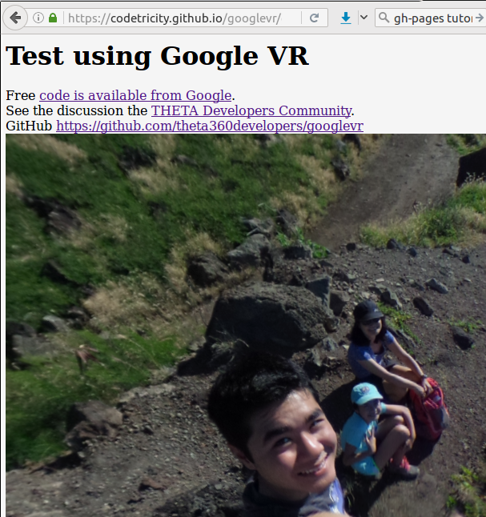

VR View
=======

Please read the documentation available at
<https://developers.google.com/vr/concepts/vrview>.

 
 
[Example](https://codetricity.github.io/googlevr/googlevr.html)

 

__To Use__

Open `googlevr.html` in a browser.

Drop your theta images into `img`

Open `googlevr.html` in your editor.

    <iframe width="100%" height="700px"
    allowfullscreen
    frameborder="0"
    src="index.html?image=img/beach.jpg&is_stereo=false"></iframe>

change the filename `beach.jpg` to your own image file.

That's it.

___attributes___

* width="100%" makes the frame go full-width.
* height="300px" sets the height of the frame.
* allowfullscreen makes it possible for the frame to go into fullscreen mode.
* frameborder="0" hides the border around the frame.

___Control parameters___

* image or video: {String} URL of image or video to load. (required)
* is_stereo: {Boolean} true if content is in stacked stereo format. (optional, default false)
* preview: {String} URL of still preview to load first. (optional, default none)
* start_yaw: {Number} Initial yaw of viewer, in degrees. (optional, default 0)
* is_yaw_only: {Boolean} true if motion is restricted to yaw only. (optional, default false)

